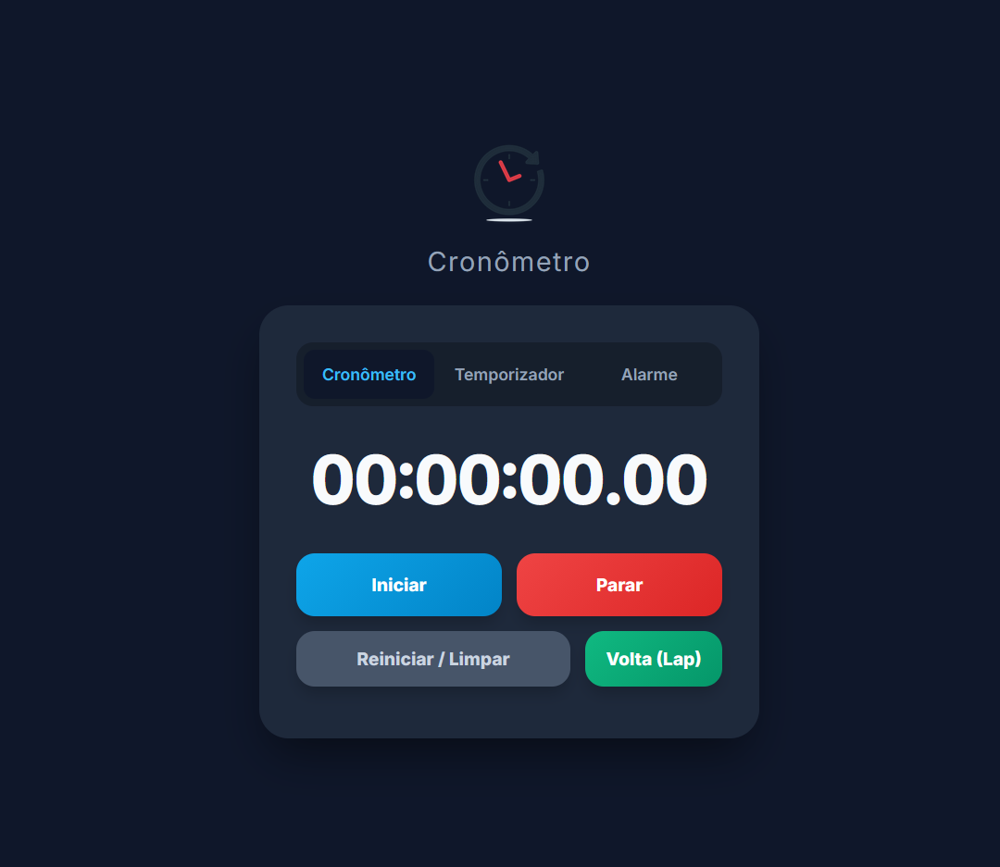

# ⏱️ Multi-Timer Studio Pro

Uma aplicação web premium, ultra-precisa e moderna que reúne **Cronômetro**, **Temporizador** e **Alarme** em uma única interface elegante, responsiva e de alta performance.

[**Live Demo 🚀**](https://fafa-dev18.github.io/simple-stopwatch/)

---

## 📸 Preview

<div align="center">
  
</div>

---

## ✨ Features

* **Cronômetro de Alta Precisão (Delta Real):** Utiliza cálculo baseado em timestamps do sistema (`Date.now()` + `requestAnimationFrame`), garantindo precisão absoluta mesmo se o navegador entrar em modo de economia de energia ou você mudar de aba.
* **Histórico de Voltas (Laps):** Registre tempos parciais em tempo real com uma tabela dinâmica e organizada diretamente na interface.
* **Temporizador Inteligente:** Inputs numéricos customizados, gigantes e modernos, totalmente livres daquelas setas nativas incômodas do navegador.
* **Alarme Persistente:** Relógio em tempo real integrado com um seletor avançado para escolher entre 3 tons premium de alarme (Bipe Digital, Clássico ou Toque Suave).
* **Persistência com `localStorage`:** O aplicativo lembra do seu último modo utilizado, do som preferido selecionado e mantém as configurações mesmo se você atualizar a página (`F5`).
* **Notificações em Interface (Toasts):** Substituição de pop-ups intrusivos do navegador (`alert()`) por avisos fluidos integrados ao próprio design do app.
* **Atalhos de Teclado:** Controle rápido de produtividade:
  * `Espaço` → Iniciar / Parar.
  * `R` → Reiniciar / Limpar o tempo.

---

## 🛠️ Technologies Used

<div align="left">
  
  
  
</div>

---

## 🚀 How to Run locally

1. **Clone the repository:**
   ```bash
   git clone [https://github.com/Fafa-dev18/simple-stopwatch.git](https://github.com/Fafa-dev18/simple-stopwatch.git)
