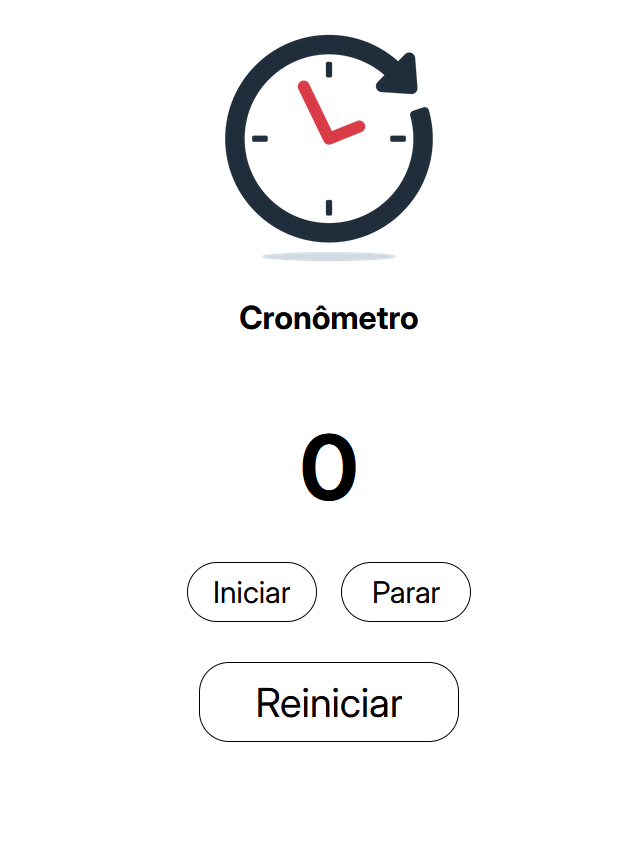

# ⏱️ Simple Stopwatch

A clean, minimalist, and fully functional web-based stopwatch built to track time with precision.

[**Live Demo 🚀**](https://fafa-dev18.github.io/simple-stopwatch/)

---

## 📸 Preview

<div align="center">
  
</div>

---

## ✨ Features

* **Simple & Intuitive:** No bloat, just a straightforward stopwatch interface.
* **Precise Timekeeping:** Accurately tracks hours, minutes, seconds, and milliseconds.
* **Responsive Design:** Works flawlessly on both desktop and mobile screens.

---

## 🛠️ Technologies Used

<div align="left">
  
  
  
</div>

---

## 🚀 How to Run locally

1. **Clone the repository:**
   ```bash
   git clone [https://github.com/Fafa-dev18/simple-stopwatch.git](https://github.com/Fafa-dev18/simple-stopwatch.git)
